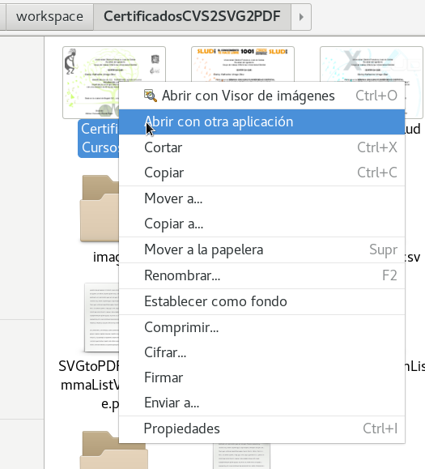
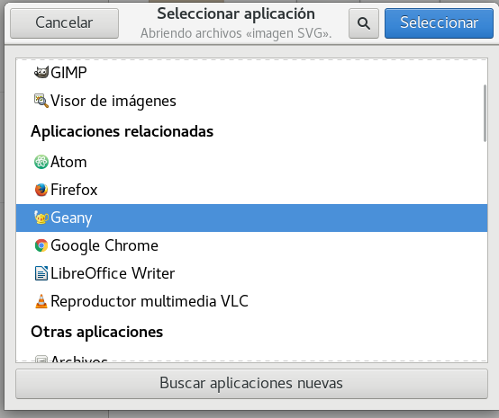
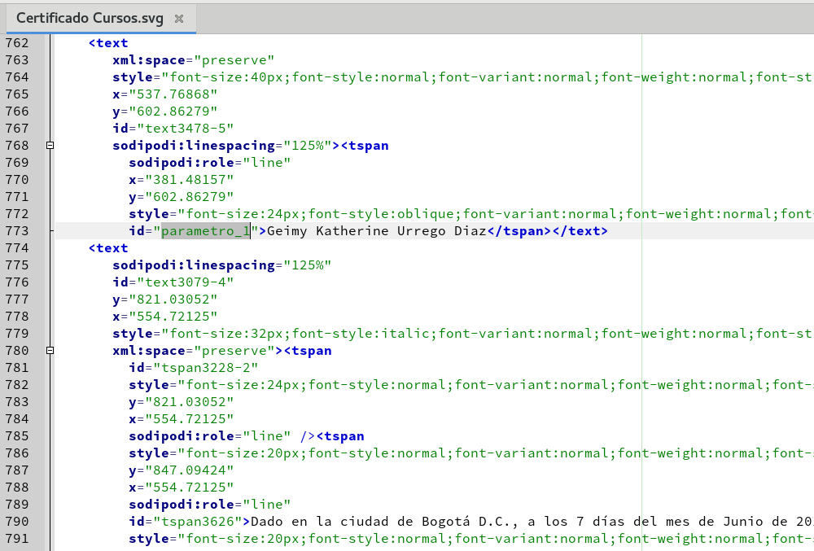
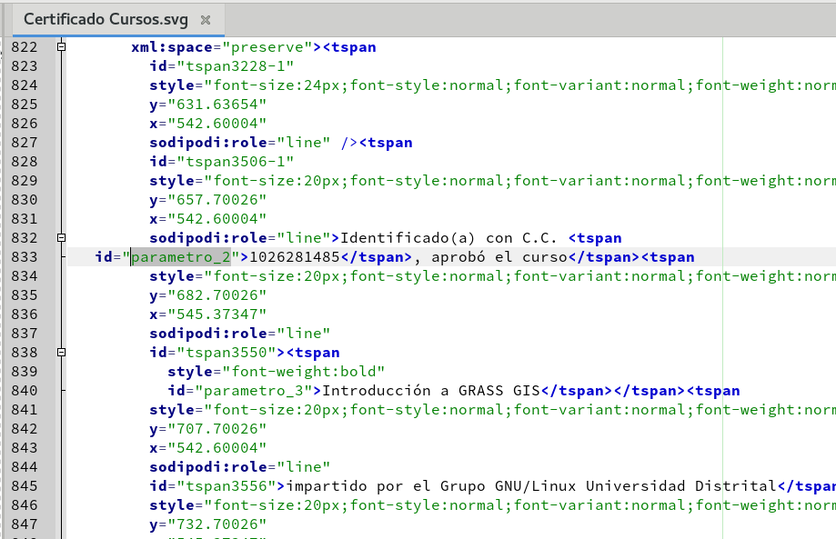

# CertificadosCVS2SVG2PDF

## DEPENDENCIAS

* python 2.7

* inkscape 0.91

## USO

Existen varios scripts que se acomodan a las necesidades. El proceso se traduce en coger un SVG y abrirlo como texto, modificar el ID de algún contenedor de texto y guardar esa modificación. Los ID's tienen la forma "parametro_#" donde "#" puede ser 1, 2, 3, 4 ... n.

El más básico soporta el cambio de un contenedor de texto con el ID "parametro_1". Para usarlo bastaría con escribir el comando:

```bash
./SVGtoPDFfromText.py -f Certificado\ Slud\ 2012.svg -t "Nombre del conferencista"
```

Para usar una lista se puede modificar el archivo SVGtoPDFfromListValues.sh y cambia los nombres de la lista "names" y ejecuta en terminal (este también usa el SVG con parametro_1):

```bash
./SVGtoPDFfromListValues.sh
```

También se puede utilizar un archivo de valores separados por coma CSV y con sus valores generar los certificados, este acepta 3 parámetros con los id's de SVG parametro_1,
parametro_2, parametro_3.

```bash
./SVGtoPDFfromCommaListValuesFile.py -t Certificado\ Slud\ 2012.svg -l lista.csv
```

Si se tiene un CSV con muchos parámetros, se puede usar:

```bash
./SVGtoPDFfromCSVWithParams.py -t Certificado\ Cursos.svg -l lista_cursos.csv -n 3
```

Este último es el más recomendado. Los parámetros deben ser id's dentro del XML(del archivo SVG) al estilo, parametro_1, parametro_99 ... parametro_n.

## Pasos para configurar el SVG








